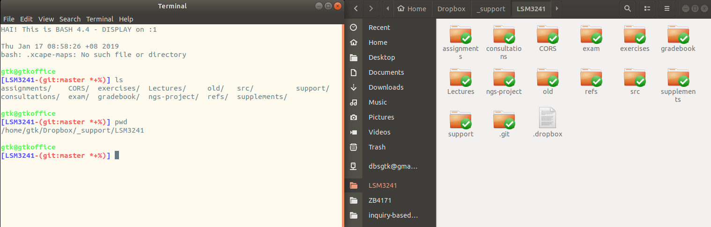

---
# Please do not edit this file directly; it is auto generated.
# Instead, please edit 01-intro.md in _episodes_rmd/
title: "Introducing the bash shell"
teaching: 10
exercises: 5
questions:
- "What is a command shell and why would I use one?"
objectives:
- "Explain how the shell relates to the keyboard, the screen, the operating system, and users' programs."
- "Explain when and why command-line interfaces should be used instead of graphical interfaces."
keypoints:
- "A shell is a program whose primary purpose is to read commands and run other programs."
- "A command-line call contain command, flags, and arguments. These are identifiable."
- "Most commands take flags (options) which begin with a `-` or a `--`."
- "The shell's main advantages are its high action-to-keystroke ratio, its support for automating repetitive tasks, and its capacity to access networked machines."
- "The shell's main disadvantages are its primarily textual nature and how cryptic its commands and operation can be."
---

### Background

We are all familiar with **graphical user interfaces** (GUI): we use windows, icons and pointers when we interact with computers. They are easy to learn and fantastic for simple tasks where a "click" translates easily into "do the thing I want". But this magic relies on 
wanting a simple set of things, and having programs that can do exactly those things.

If you wish to do complex, purpose-specific things it helps to have a richer means
of expressing your instructions to the computer. It doesn't need to be complicated or
difficult, just a vocabulary of commands and a simple grammar for using them.

This is what the shell provides - a simple language and a **command-line interface** 
to use it through. 

The heart of a command-line interface is a **read-evaluate-print loop** (REPL). It is called
so because when you type a command and press <kbd>Return</kbd> (also known as <kbd>Enter</kbd>) the shell

- Reads your command,
- Evaluates (or "executes") it,
- Prints the output of your command,
- Loops back and waits for you to enter another command.
 
### The **bash** shell

A shell is a program that provides a command line interface to the computer.
A shell can be used interactively, by sitting down and typing commands at the application window, or in *shell scripts* that automate tasks.
The most popular Unix shell is Bash, the Bourne Again SHell
(so-called because it's derived from a shell written by Stephen Bourne).
Bash is the default shell on most modern implementations of Unix
and in most packages that provide Unix-like tools for Windows.

### What does the shell interface look like?

A typical shell window looks something like the image on the left below.

Notice the *prompt*, the  *commands*, and the *output*. At all times, the shell is "in" a particular folder or directory. The `ls` command on the left lists the contents of the directory. The image on the right shows a graphical view of the same folder. Note that the contents shown on the left (from `ls`) are the same as those on the right, except the right side shows two additional items: the folder `.git` and the file `.dropbox`. 

> ## hidden items
> Items whose names begin with `.` are normally hidden when working in the shell. 
>
{: .callout}

### We interact with the shell by typing commmands

~~~
bash-3.2$ 
bash-3.2$ ls -F / 
~~~
{: .bash}

The first line shows only a **prompt**,
indicating that the shell is waiting for input.
Your shell may use different text for the prompt. Most importantly: 
when typing commands, either from these lessons or from other sources,
*do not type the prompt*, only the commands that follow it.

The part that you type,
`ls -F /` in the second line of the example,
typically has the following structure: a **command**,
some **flags** (also called **options** or **switches**) followed by and **argument** or arguments.
Flags start with a single dash (`-`) or two dashes (`--`), and change the behaviour of a command.
Arguments tell the command what to operate on (e.g. files and directories).
Sometimes flags and arguments are referred to as parameters.
A command can be called with more than one flag and more than one argument: but a
command doesn't always require an argument or a flag.

In the second line of the example above, our **command** is `ls`, with a **flag** `-F` and an
**argument** `/`. Each part is separated by spaces: if you omit the space 
between `ls` and `-F` the shell will look for a command called `ls-F`, which 
doesn't exist. Also, capitalization matters: `LS` is different from `ls`. 

Here's what the output might look like from that command

~~~
Applications/         System/
Library/              Users/
Network/              Volumes/
bash-3.2$ 
~~~
{: .output}

Next we see the output that our command produced. In this case it is a listing 
of files and folders in a location called `/` - we'll cover what all these mean 
later today. Those using a macOS might recognize the output in this example.

Finally, the shell again prints the prompt and waits for you to type the next 
command.

In the examples for this lesson, we'll show the prompt as `$`, or we'll leave it out entirely. You can make your prompt look the same by executing the command `PS1='$ '`. But you can also leave 
your prompt as it is - often the prompt includes useful information about who and where 
you are.

> ## Try it!
> 
> Open a shell window and type two commands, one at a time:  First, type `ls`<kbd>Enter</kbd>.  Then
> type `ls -a`<kbd>Enter</kbd>. Do you see any differences between the output of the two commands?
> 
> > 
> > ## Solution
> >
> > The `ls -a` command may show some additional files that begin with a `.`. The `-a` flag tells `ls`
> > to list *all* the files, whether they are hidden or not.
> {: .solution}
{: .challenge}

Open a shell window and try executing `ls -F /` for yourself (don't forget that spaces
and capitalization are important!). You can change the prompt too, if you like.

### How does the shell know what `ls` and its flags mean?

Every command is a program stored somewhere on the computer, and the shell keeps a
list of places to search for commands (the list is in a **variable** called `PATH`, 
but those are concepts we'll meet later and are not too important at the moment). Recall
that commands, flags and arguments are separated by spaces.

> ## Flag conventions: `-` versus `--` 
> 
> Flags are usually indicated by a leading `-` or `--`. By common convention, `-` flags use a letter
> (like `-F`), while `--` flags use words (like `--help`). Also by common convention, one letter
> flags can be combined, so that `ls -la` is identical to `ls -l -a`.
> 
> These conventions are not rules, and are often violated.
{: .idea}

So let's look at the REPL (read-evaluate-print loop) in more detail. Notice that the
"evaluate" step is made of two parts:

1. Read what was typed (`ls -F /` in our example)  
    The shell uses the spaces to split the line into the command, flags, and arguments
2. Evaluate:  
    a. Find a program called `ls`  
    b. Execute it, passing it the flags and arguments (`-F` and `/`) to 
       interpret as the program sees fit 
3. Print the output produced by the program

and then print the prompt and wait for you to enter another command.

> ## Command not found 
> If the shell can't find a program whose name is the command you typed, it 
> will print an error message:
> 
> ~~~
> $ ls-F
> ~~~
> {: .language-bash}
> ~~~
> -bash: ls-F: command not found
> ~~~
> {: .output}
> 
> Usually this means that you have mis-typed the command - in this case we omitted
> the space between `ls` and `-F`. 
{: .warning}

### Is it difficult?

It is a different model of interacting than a GUI, and that 
will take some effort - and some time - to learn. A GUI 
presents you with choices and you select one. With a **command line interface** (CLI) the choices are combinations 
of commands and parameters, more like words in a language than buttons on a screen. They
are not presented to you so
you must learn a few, like learning some vocabulary in a new language. But a small 
number of commands gets you a long way, and we'll cover those essential few today.

### Flexibility and automation 

The grammar of a shell allows you to combine existing tools into powerful
pipelines and handle large volumes of data automatically. Sequences of
commands can be written into a *script*, improving the reproducibility of 
workflows and allowing you to repeat them easily.

In addition, the command line is often the easiest way to interact with remote machines and supercomputers.
Familiarity with the shell is near essential to run a variety of specialized tools and resources
including high-performance computing systems.
As clusters and cloud computing systems become more popular for scientific data crunching,
being able to interact with the shell is becoming a necessary skill.
We can build on the command-line skills covered here
to tackle a wide range of scientific questions and computational challenges.

## Nelle's Pipeline: Starting Point

Nelle Nemo, a marine biologist,
has just returned from a six-month survey of the
[North Pacific Gyre](http://en.wikipedia.org/wiki/North_Pacific_Gyre),
where she has been sampling gelatinous marine life in the
[Great Pacific Garbage Patch](http://en.wikipedia.org/wiki/Great_Pacific_Garbage_Patch).
She has 1520 samples in all and now needs to:

1.  Run each sample through an assay machine
    that will measure the relative abundance of 300 different proteins.
    The machine's output for a single sample is
    a file with one line for each protein.
2.  Calculate statistics for each of the proteins separately
    using a program her supervisor wrote called `goostats`.
3.  Write up results.
    Her supervisor would really like her to do this by the end of the month
    so that her paper can appear in an upcoming special issue of *Aquatic Goo Letters*.

It takes about half an hour for the assay machine to process each sample.
The good news is that
it only takes two minutes to set each one up.
Since her lab has eight assay machines that she can use in parallel,
this step will "only" take about two weeks.

The bad news is that if she has to run `goostats` by hand using a GUI,
she'll have to select a file using an open file dialog 1520 times.
At 30 seconds per sample,
the whole process will take more than 12 hours
(and that's assuming the best-case scenario where she is ready to select the next file
as soon as the previous sample analysis has finished).
This zero-breaks always-ready scenario is only achievable by a machine so it would
likely take much longer than 12 hours, not to mention that
the chances of her selecting all of those files correctly are practically zero.
Missing that paper deadline is looking increasingly likely.

The next few lessons will explore what she should do instead.
More specifically,
they explain how she can use a command shell to run the `goostats` program,
using loops to automate the repetitive steps e.g. entering file names,
so that her computer can work 24 hours a day while she writes her paper.

As a bonus,
once she has put a processing pipeline together,
she will be able to use it again whenever she collects more data.

